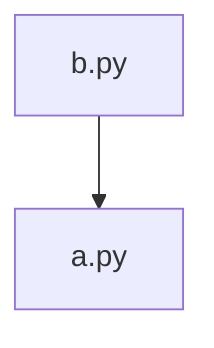

# better-context-amp

> Auto-generated context for AI agents. Last updated: 2026-01-24T16:30:40.804149+00:00

## 📋 Purpose

A React application with 101 files.

## 📂 Structure

```
├── .ctx.json.example
├── .gitignore
├── AGENTS.md
├── README.md
├── better-context-plan.md
├── pyproject.toml
├── .beads/
│   ├── .gitignore
│   ├── .local_version
│   ├── AGENTS.md
│   ├── config.yaml
│   ├── daemon.lock
│   ├── daemon.log
│   ├── issues.jsonl
│   ├── last-touched
│   └── metadata.json
├── fixtures/
│   ├── AGENTS.md
│   ├── python-simple/
│   │   ├── AGENTS.md
│   │   ├── main.py
│   │   ├── models.py
│   │   ├── utils.py
│   │   ├── expected/
│   │   │   ├── AGENTS.md
│   │   │   ├── graph.json
│   │   │   └── inventory.json
│   │   ├── services/
│   │   │   ├── AGENTS.md
│   │   │   ├── __init__.py
│   │   │   └── auth.py
│   │   └── tests/
│   │       ├── AGENTS.md
│   │       └── test_auth.py
│   ├── ts-simple/
│   │   ├── AGENTS.md
│   │   ├── index.ts
│   │   ├── types.ts
│   │   ├── utils.ts
│   │   ├── api/
│   │   │   ├── AGENTS.md
│   │   │   ├── client.ts
│   │   │   └── index.ts
│   │   ├── components/
│   │   │   ├── AGENTS.md
│   │   │   └── Button.tsx
│   │   └── expected/
│   │       ├── AGENTS.md
│   │       └── inventory.json
│   └── with-cycles/
│       ├── AGENTS.md
│       ├── a.py
│       ├── b.py
│       ├── c.py
│       ├── standalone.py
│       └── expected/
│           ├── AGENTS.md
│           └── graph.json
├── src/
│   ├── AGENTS.md
│   └── better_context/
│       ├── AGENTS.md
│       ├── __init__.py
│       ├── architecture.py
│       ├── cache.py
│       ├── callgraph.py
│       ├── centrality.py
│       ├── chunker.py
│       ├── cli.py
│       ├── config.py
│       ├── coupling.py
│       ├── errors.py
│       ├── focus.py
│       ├── generator.py
│       ├── graph.py
│       ├── ignore.py
│       ├── manifest.py
│       ├── optimizer.py
│       ├── orchestrator.py
│       ├── resolution.py
│       ├── scanner.py
│       ├── semantic_anchor.py
│       ├── staleness.py
│       ├── template.py
│       ├── tree.py
│       ├── visualize.py
│       └── languages/
│           ├── AGENTS.md
│           ├── __init__.py
│           ├── base.py
│           ├── go.py
│           ├── python.py
│           └── typescript.py
└── tests/
    ├── AGENTS.md
    ├── __init__.py
    ├── test_architecture.py
    ├── test_betweenness.py
    ├── test_cache.py
    ├── test_callgraph.py
    ├── test_cli.py
    ├── test_config.py
    ├── test_coupling.py
    ├── test_errors.py
    ├── test_focus.py
    ├── test_go_adapter.py
    ├── test_ignore.py
    ├── test_languages.py
    ├── test_manifest.py
    ├── test_optimizer.py
    ├── test_python_adapter.py
    ├── test_scanner.py
    ├── test_semantic_anchor.py
    ├── test_staleness.py
    ├── test_template.py
    ├── test_tree.py
    └── test_visualize_architecture.py
```

## 🔑 Key Files (by Centrality)

| File | Score | Why It Matters |
|------|-------|----------------|
- `fixtures/with-cycles/b.py` | 0.0521 | 2 exports - 1 dependents |
- `fixtures/with-cycles/a.py` | 0.0521 | 2 exports - 1 dependents |
- `fixtures/with-cycles/c.py` | 0.0521 | 2 exports - 1 dependents |
- `fixtures/python-simple/models.py` | 0.0182 | 3 exports - 2 dependents |
- `src/better_context/architecture.py` | 0.0148 | 13 exports - 1 dependents |
- `src/better_context/coupling.py` | 0.0148 | 13 exports - 1 dependents |
- `src/better_context/cache.py` | 0.0148 | 9 exports - 1 dependents |
- `src/better_context/callgraph.py` | 0.0148 | 16 exports - 1 dependents |
- `src/better_context/semantic_anchor.py` | 0.0148 | 14 exports - 1 dependents |
- `fixtures/ts-simple/utils.ts` | 0.0148 | 4 exports - 1 dependents |


## 🏗️ Architecture Layers

| Layer | Files | Description |
|-------|-------|-------------|
- 0 | 89 | Foundation (no dependencies) |
- 1 | 9 | Core utilities and helpers |


## 📦 Dependencies

### External (Top 10)
- _
- __future__
- a
- argparse
- better_context
- c
- collections
- dataclasses
- datetime
- fnmatch

### Internal Cross-References



## ⚠️ Circular Dependencies

The following cycles were detected:
- fixtures/with-cycles/c.py → fixtures/with-cycles/a.py → fixtures/with-cycles/b.py → fixtures/with-cycles/c.py


## 📊 Metrics

- **Total Files**: 101
- **Total Definitions**: 1028
- **Internal Dependencies**: 13
- **External Packages**: 10


## 🧭 Navigation

- **.beads module?** Start with: [`./.beads/AGENTS.md`](./.beads/AGENTS.md)
- **fixtures module?** Start with: [`./fixtures/AGENTS.md`](./fixtures/AGENTS.md)
- **Source code?** Start with: [`./src/AGENTS.md`](./src/AGENTS.md)
- **Test files?** Start with: [`./tests/AGENTS.md`](./tests/AGENTS.md)


---
*Navigate to subdirectories for more detailed context.*
