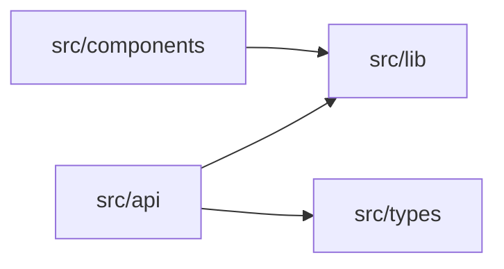
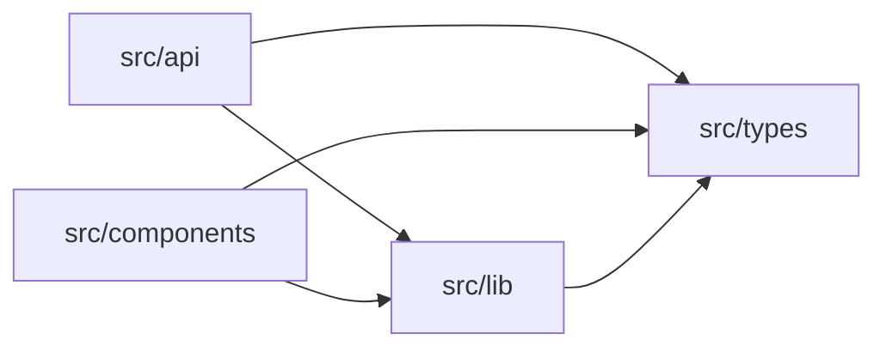

# Better Context: AI Agent Codebase Intelligence CLI

> **Project**: AI Agent Codebase Intelligence CLI  
> **Version**: 2.0.0 (Hybrid Edition)  
> **Last Updated**: 2026-01-24  
> **Status**: Implementation-Ready Plan

---

## Vision

A CLI tool that programmatically processes codebases, breaking them into mathematically structured, semantically meaningful pieces that AI agents can progressively consume. The output is a hierarchy of `AGENTS.md` files providing contextual understanding at every level of the codebase.

**Core Insight**: Instead of dumping entire files or relying on grep, we use **Fractal Summarization** with **Graph Theory** to create navigable knowledge hierarchies.

---

## Executive Summary

This plan synthesizes the best ideas from multiple approaches to create a comprehensive, practical, and mathematically grounded codebase intelligence system. It explicitly defines what we're building, what we're NOT building, and why.

### Key Value Proposition

- Transforms unstructured code into structured, AI-consumable context
- Uses dual-mode parsing (regex fallback + tree-sitter) for robustness
- Builds dependency graphs with cycle detection and topological layering
- Applies PageRank centrality for mathematically-principled file ranking
- Generates progressive disclosure via hierarchical AGENTS.md files
- Works with zero dependencies (core) or enhanced dependencies (optional)

### Design Philosophy

1. **Mathematics & Structure First**: Use graph theory (PageRank centrality, dependency graphs, Tarjan's SCC, Kahn's topological sort) for quantitative, reproducible analysis
2. **Fractal Summarization**: Every folder is a node containing a summary of itself and pointers to children—agents never face walls of text, only navigable maps
3. **Progressive Disclosure**: Multi-level AGENTS.md hierarchy enables context-aware exploration with depth control
4. **Pragmatic Implementation**: Start simple (regex + built-in ast), enhance incrementally (tree-sitter)
5. **Language Agnostic**: Common abstractions with pluggable language adapters
6. **Manifest-First Architecture**: JSON intermediate representation decouples scanning from generation
7. **Zero-to-Hero Dependencies**: Core functionality works with zero external deps; enhanced features opt-in

---

## Architecture Overview

```
┌─────────────────────────────────────────────────────────────────────────┐
│                              CLI Layer                                   │
│  ┌──────────┐  ┌──────────┐  ┌──────────┐  ┌──────────┐  ┌──────────┐  │
│  │   scan   │  │  agents  │  │    all   │  │  stats   │  │  clean   │  │
│  └────┬─────┘  └────┬─────┘  └────┬─────┘  └────┬─────┘  └────┬─────┘  │
│       │             │             │             │             │         │
│       └─────────────┴──────┬──────┴─────────────┴─────────────┘         │
│                            ▼                                             │
├─────────────────────────────────────────────────────────────────────────┤
│                         Core Analyzer                                    │
│                                                                          │
│  ┌────────────────┐    ┌──────────────────┐    ┌────────────────────┐   │
│  │    Scanner     │    │   Manifest.json  │    │  AGENTS.md Writer  │   │
│  │  (file disco)  │ → │  (intermediate)  │ → │   (output gen)     │   │
│  └───────┬────────┘    └────────┬─────────┘    └────────────────────┘   │
│          │                      │                                        │
│          ▼                      ▼                                        │
│  ┌────────────────────────────────────────────────────────────────────┐ │
│  │                      Dual-Mode Parser                               │ │
│  │  ┌─────────────────────┐    ┌─────────────────────────────────┐   │ │
│  │  │  Regex Fallback     │ OR │  Tree-sitter AST (optional)     │   │ │
│  │  │  (zero deps)        │    │  (enhanced parsing)             │   │ │
│  │  └─────────────────────┘    └─────────────────────────────────┘   │ │
│  └────────────────────────────────────────────────────────────────────┘ │
│                                                                          │
│  ┌────────────────────────────────────────────────────────────────────┐ │
│  │                     Language Adapters                               │ │
│  │  ┌────────┐  ┌──────────┐  ┌────────┐  ┌──────┐  ┌──────┐        │ │
│  │  │ Python │  │TypeScript│  │   Go   │  │ Rust │  │ Java │        │ │
│  │  └────────┘  └──────────┘  └────────┘  └──────┘  └──────┘        │ │
│  └────────────────────────────────────────────────────────────────────┘ │
│                                                                          │
├─────────────────────────────────────────────────────────────────────────┤
│                        Analysis Modules                                  │
│                                                                          │
│  ┌───────────────┐  ┌───────────────┐  ┌────────────────────────────┐  │
│  │  Dependency   │  │   PageRank    │  │    Coupling Metrics        │  │
│  │    Graph      │  │  Centrality   │  │    (Ca/Ce/I/A/D)           │  │
│  └───────────────┘  └───────────────┘  └────────────────────────────┘  │
│                                                                          │
│  ┌───────────────┐  ┌───────────────┐  ┌────────────────────────────┐  │
│  │ Cycle Detect  │  │  Topological  │  │  Architecture Detection    │  │
│  │ (Tarjan SCC)  │  │    Layers     │  │  (layer classification)    │  │
│  └───────────────┘  └───────────────┘  └────────────────────────────┘  │
│                                                                          │
└─────────────────────────────────────────────────────────────────────────┘
                                   │
                                   ▼
                        ┌─────────────────────┐
                        │    AGENTS.md        │
                        │    Hierarchy        │
                        │  (per directory)    │
                        └─────────────────────┘
```

---

## Scope Definition

### Goals (What We're Building)

| Goal | Description | Priority |
|------|-------------|----------|
| Usable CLI | Clear subcommands: `scan`, `agents`, `all`, `stats`, `clean` | P0 |
| Customizable behavior | `.ctx.json` config and `.ctxignore` patterns | P0 |
| Stable intermediate format | Manifest JSON as contract between scan and generate | P0 |
| Structure-aware chunking | Semantic boundaries (functions, classes) with size caps | P0 |
| Readable output | AGENTS.md files that humans and agents can navigate | P0 |
| Graph-based analysis | PageRank, cycle detection, topological layers | P0 |
| Multi-language support | Python, TypeScript, JavaScript, Go, Rust (extensible) | P1 |
| Incremental updates | Hash-based caching to avoid full re-scans | P1 |
| Coupling metrics | Ca/Ce/I/A/D metrics per module | P1 |

### Non-Goals (What We're NOT Building in MVP)

| Non-Goal | Reason for Rejection |
|----------|---------------------|
| Full tree-sitter requirement | Heavy dependency; regex fallback sufficient for MVP |
| Complex UI or web frontends | CLI-first; GUIs can be added later |
| Git-aware/change-aware scanning | Workflow-dependent complexity |
| Streaming for huge repos | Parallelization complexity |
| Multiple output formats beyond JSON+MD | Keep focused on core value |
| Vector/embedding indexing | Dependency-heavy; defer to P2 |
| LSP integration | Expensive; separate project |
| AI-generated summaries | Keep tool deterministic; AI can consume output |
| Docstring/comment extraction | Risk of misleading summaries |
| Unit tests in first iteration | Speed to MVP; add after validation |

---

## 35 Ideas for Implementation

### Core Infrastructure Ideas (1-10)

1. **AST-based code chunking** - Use tree-sitter to parse code into semantic units (functions, classes, modules)
2. **Dependency graph construction** - Build a directed graph of imports/exports between files
3. **Call graph analysis** - Map function call relationships across the codebase
4. **Semantic clustering** - Group related code using embedding similarity
5. **Progressive disclosure hierarchy** - Generate multi-level summaries (folder → file → function)
6. **Symbol table extraction** - Extract all exported symbols with their signatures
7. **Type flow analysis** - Track how types propagate through the codebase
8. **Concept tagging** - Auto-tag code with domain concepts (auth, payments, etc.)
9. **Coupling metrics** - Calculate afferent/efferent coupling for each module
10. **Cyclomatic complexity mapping** - Identify complex hotspots requiring more context

### Source Analysis Ideas (11-20)

11. **Change frequency analysis** - Use git history to identify volatile vs stable code
12. **Code ownership mapping** - Track who owns what via git blame patterns
13. **API surface extraction** - Identify public interfaces vs internal implementation
14. **Test coverage mapping** - Link tests to the code they cover
15. **Documentation extraction** - Pull JSDoc, docstrings, README content into context
16. **Cross-reference indexing** - Build a searchable index of all symbols and usages
17. **Architectural boundary detection** - Identify layers, domains, bounded contexts
18. **Dead code identification** - Find unreachable/unused code to exclude from context
19. **Configuration extraction** - Map env vars, config files, feature flags
20. **Framework pattern detection** - Identify framework-specific patterns (React components, Express routes)

### Advanced Analysis Ideas (21-30)

21. **Error handling flow** - Map error propagation paths
22. **State management mapping** - Track global state, stores, context providers
23. **Side effect annotation** - Mark functions with IO, network, or state mutations
24. **Invariant extraction** - Identify assertions, validations, type guards
25. **Migration path detection** - Identify deprecated patterns and their replacements
26. **Monorepo boundary detection** - Handle multi-package repositories intelligently
27. **Language-agnostic core** - Support multiple languages via tree-sitter grammars
28. **Incremental updates** - Only re-process changed files on subsequent runs
29. **Context budget optimization** - Prioritize most relevant context given token limits
30. **Interactive exploration mode** - Allow agents to query specific aspects on-demand

### Hybrid Additions from Competing Models (31-35)

31. **PageRank centrality scoring** - Rank file importance using graph centrality algorithms *(Gemini: Mathematical rigor)*
32. **Manifest JSON as stable contract** - Intermediate representation enabling tooling hooks *(Codex: Decoupling)*
33. **Binary detection and skipping** - Automatically filter non-text files *(Codex: Noise reduction)*
34. **Configurable ignore patterns** - .ctxignore file for gitignore-like exclusions *(Codex: User control)*
35. **Pre-commit hook integration** - Auto-update AGENTS.md files on commit *(Claude: DevOps integration)*

---

## Critical Evaluation

### Rejected Ideas (with reasons)

| # | Idea | Rejection Reason |
|---|------|------------------|
| 6 | Symbol table extraction | Subsumed by AST-based chunking (#1) - symbols are extracted as part of AST parsing |
| 7 | Type flow analysis | Too complex for initial version, requires full type inference engine |
| 10 | Cyclomatic complexity | Nice-to-have metric but doesn't directly help context understanding |
| 11 | Change frequency analysis | Requires git history, adds complexity, low priority for core functionality |
| 12 | Code ownership | Not relevant to AI agent understanding - more for team dynamics |
| 14 | Test coverage mapping | Requires running coverage tools, external dependency |
| 20 | Framework pattern detection | Too many frameworks, hard to generalize, better left to AI interpretation |
| 21 | Error handling flow | Specialized case of call graph, can be derived from #3 |
| 24 | Invariant extraction | Highly language-specific, edge case utility |
| 25 | Migration path detection | Requires historical knowledge, out of scope |

### Accepted Ideas (with priority)

| Priority | # | Idea | Justification |
|----------|---|------|---------------|
| **P0 (Core)** | 1 | AST-based code chunking | **Core foundation** - everything builds on this |
| **P0** | 2 | Dependency graph | **Essential** - understanding imports/exports is fundamental |
| **P0** | 5 | Progressive disclosure | **Core output format** - the AGENTS.md hierarchy |
| **P0** | 27 | Language-agnostic core | **Essential** - tree-sitter enables this cleanly |
| **P0** | 31 | PageRank centrality scoring | **High value** - quantifies "key files" objectively *(Gemini)* |
| **P0** | 32 | Manifest JSON intermediate | **Essential** - decouples scanning from generation *(Codex)* |
| **P0** | 33 | Binary detection | **Essential** - reduces noise *(Codex)* |
| **P0** | 34 | Configurable ignores | **Essential** - every repo needs this *(Codex)* |
| **P1** | 3 | Call graph analysis | Deep understanding of code flow |
| **P1** | 4 | Semantic clustering | Groups related code for better context |
| **P1** | 9 | Coupling metrics | Identifies module boundaries |
| **P1** | 13 | API surface extraction | Distinguishes public/private interfaces |
| **P1** | 17 | Architectural boundary detection | Identifies high-level structure |
| **P1** | 28 | Incremental updates | Essential for large codebases |
| **P2** | 8 | Concept tagging | Adds semantic meaning beyond structure |
| **P2** | 15 | Documentation extraction | Existing docs are valuable context |
| **P2** | 16 | Cross-reference indexing | Powers queries and navigation |
| **P2** | 18 | Dead code identification | Reduces noise in context |
| **P2** | 19 | Configuration extraction | Important for understanding behavior |
| **P2** | 22 | State management mapping | Critical for stateful applications |
| **P2** | 23 | Side effect annotation | Helps understand function behavior |
| **P2** | 26 | Monorepo boundary detection | Common in modern codebases |
| **P3** | 29 | Context budget optimization | Optimization for token limits |
| **P3** | 30 | Interactive exploration | Advanced agent integration |

---

## Detailed Implementation Plan

### Phase 0: Foundation (Days 1-3)

#### Idea #32: Manifest JSON as Intermediate Representation (P0) ✅ *(From Codex)*

**What:** A structured JSON manifest as the single source of truth between scanning and generation phases.

**Why:** Decouples the parsing/scan phase from output generation, enabling:
- Alternate output formats without re-scanning
- Incremental updates via manifest diffing
- External tooling integration
- Version-stable contract

**Schema (Current):**

| Field | Type | Description |
|-------|------|-------------|
| `root` | string | Absolute path to repository root |
| `version` | string | Schema version for compatibility |
| `generated_at` | string | ISO 8601 UTC timestamp |
| `files` | FileEntry[] | List of analyzed files |
| `graph` | DependencyGraph | Optional: full graph data |

**Python Implementation (Zero Dependencies):**

```python
# manifest.py
from dataclasses import dataclass, asdict
from typing import List, Dict, Optional
import json
from datetime import datetime

@dataclass
class ChunkMetadata:
    """Rich metadata for code chunks (enhanced from Gemini)."""
    is_async: bool = False
    is_generator: bool = False
    is_static: bool = False
    is_abstract: bool = False
    visibility: str = 'public'  # 'public' | 'private' | 'protected'
    decorators: List[str] = None
    complexity: int = 0  # Lines + branching keywords count
    
    def __post_init__(self):
        if self.decorators is None:
            self.decorators = []

@dataclass
class ChunkInfo:
    """Represents a semantic code unit."""
    id: int
    type: str  # 'function' | 'class' | 'interface' | 'type' | 'method' | 'variable'
    name: str
    signature: str
    start_line: int
    end_line: int
    char_count: int
    exported: bool = False
    docstring: Optional[str] = None
    parent_id: Optional[int] = None
    children: List[int] = None
    metadata: Optional[ChunkMetadata] = None
    
    def __post_init__(self):
        if self.children is None:
            self.children = []

@dataclass
class FileEntry:
    """Represents an analyzed source file."""
    path: str
    language: str
    size: int
    hash: str  # SHA-256 for incremental updates
    chunks: List[ChunkInfo]
    imports: List[Dict] = None
    exports: List[Dict] = None
    
    def __post_init__(self):
        if self.imports is None:
            self.imports = []
        if self.exports is None:
            self.exports = []

@dataclass
class Manifest:
    """The complete analysis manifest."""
    root: str
    version: str
    generated_at: str
    files: List[FileEntry]
    
    def to_json(self, path: str):
        import os
        os.makedirs(os.path.dirname(path), exist_ok=True)
        with open(path, 'w') as f:
            json.dump(asdict(self), f, indent=2)
    
    @classmethod
    def from_json(cls, path: str) -> 'Manifest':
        with open(path) as f:
            data = json.load(f)
        return cls(**data)
    
    @classmethod
    def create(cls, root: str, files: List[FileEntry]) -> 'Manifest':
        return cls(
            root=os.path.abspath(root),
            version='1.0.0',
            generated_at=datetime.utcnow().isoformat() + 'Z',
            files=files
        )
```

**TypeScript Implementation (Enhanced Types from Gemini):**

```typescript
// src/types/index.ts
type ChunkType = 'function' | 'class' | 'interface' | 'type' | 'variable' 
               | 'method' | 'property' | 'enum' | 'namespace';

type Visibility = 'public' | 'private' | 'protected';

interface ChunkMetadata {
  isAsync: boolean;
  isGenerator: boolean;
  isStatic: boolean;
  isAbstract: boolean;
  visibility: Visibility;
  decorators: string[];
  complexity: number;  // Lines + branching keywords
}

interface CodeChunk {
  id: string;                    // Unique: file:line:type:name
  type: ChunkType;
  name: string;
  signature: string;             // Type/function signature
  body: string;                  // Full source code
  filePath: string;
  startLine: number;
  endLine: number;
  children: string[];            // IDs of nested chunks
  parent: string | null;         // ID of containing chunk
  exported: boolean;
  docstring: string | null;
  metadata: ChunkMetadata;
}

interface ImportStatement {
  path: string;
  symbols: string[];
  isTypeOnly: boolean;
  isDynamic: boolean;
  isNamespace: boolean;
  alias: string | null;
}

interface ExportStatement {
  name: string;
  isDefault: boolean;
  isReExport: boolean;
  sourcePath: string | null;
}

interface FileEntry {
  path: string;
  language: string;
  size: number;
  hash: string;                  // SHA-256 for caching
  chunks: CodeChunk[];
  imports: ImportStatement[];
  exports: ExportStatement[];
}

interface Manifest {
  root: string;
  version: string;
  generatedAt: string;
  files: FileEntry[];
}
```

**Downsides:**
- Needs versioning if schema evolves
- Extra disk I/O for serialization
- TypeScript enums may not serialize cleanly

**Confidence:** 90%

---

#### Idea #34: Configurable Ignore Patterns (P0) ✅ *(From Codex)*

**What:** A `.ctxignore` file and JSON config for excluding files/directories from analysis.

**Why:** Every repository has noise (node_modules, build artifacts, vendor code). Users need control without forking the tool.

**.ctxignore Behavior:**
- If `use_ctxignore` is true, lines from `.ctxignore` are appended to the ignore patterns list
- Blank lines are ignored
- Lines starting with `#` are treated as comments
- Patterns ending with `/` match directories
- Glob patterns (e.g., `*.min.js`) match file names

**Implementation:**

```python
# config.py
import os
import json
import copy
import fnmatch
from typing import List, Dict, Any

DEFAULT_CONFIG = {
    "chunking": {
        "max_chars": 2400,
        "max_lines": 200,
        "min_chunk_chars": 200,
    },
    "ignore": {
        "use_ctxignore": True,
        "patterns": [
            # Version control
            ".git/", ".svn/", ".hg/",
            # IDE/editor
            ".idea/", ".vscode/", "*.swp",
            # Python
            "__pycache__/", ".venv/", "*.pyc", ".pytest_cache/", 
            ".mypy_cache/", ".ruff_cache/",
            # JavaScript/Node
            "node_modules/", "dist/", "build/", ".next/",
            "*.min.js", "*.bundle.js", "*.map",
            # Output (avoid recursion)
            ".context/", "AGENTS.md",
        ],
    },
    "output": {
        "manifest_path": ".context/manifest.json",
        "agents_md": True,
    },
    "analysis": {
        "pagerank_iterations": 20,
        "pagerank_damping": 0.85,
        "key_files_count": 5,
    },
}

def deep_update(base: Dict[str, Any], updates: Dict[str, Any]) -> Dict[str, Any]:
    """Recursively merge updates into base dict."""
    for key, value in updates.items():
        if key in base and isinstance(base[key], dict) and isinstance(value, dict):
            deep_update(base[key], value)
        else:
            base[key] = value
    return base

def load_config(root: str, config_path: str = None) -> dict:
    """Load configuration with deep merging and .ctxignore support."""
    config = copy.deepcopy(DEFAULT_CONFIG)
    
    # Load .ctx.json if exists
    ctx_json = config_path or os.path.join(root, ".ctx.json")
    if os.path.exists(ctx_json):
        with open(ctx_json) as f:
            user_config = json.load(f)
        deep_update(config, user_config)
    
    # Load .ctxignore patterns (with comment support from Codex)
    if config["ignore"]["use_ctxignore"]:
        ctxignore = os.path.join(root, ".ctxignore")
        if os.path.exists(ctxignore):
            with open(ctxignore) as f:
                for line in f:
                    stripped = line.strip()
                    # Skip empty lines and comments
                    if stripped and not stripped.startswith('#'):
                        config["ignore"]["patterns"].append(stripped)
    
    return config

def should_ignore(rel_path: str, patterns: List[str]) -> bool:
    """Check if a path matches any ignore pattern."""
    for pattern in patterns:
        if pattern.endswith("/"):
            # Directory pattern - match if path starts with pattern
            dir_name = pattern.rstrip("/")
            if rel_path == dir_name or rel_path.startswith(dir_name + "/"):
                return True
        elif fnmatch.fnmatch(rel_path, pattern):
            return True
        elif fnmatch.fnmatch(os.path.basename(rel_path), pattern):
            # Also try matching just the filename
            return True
    return False
```

**Example .ctxignore file:**

```
# Dependencies and build artifacts
node_modules/
dist/
build/

# Large generated files
*.bundle.js
*.min.js
*.map

# Project-specific
legacy/
vendor/
```

**Downsides:**
- Pattern semantics must be predictable (documented above)
- Edge cases with nested ignores
- Glob patterns have some limitations vs full regex

**Confidence:** 95%

---

#### Idea #33: Binary Detection and Skipping (P0) ✅ *(From Codex)*

**What:** Lightweight detection of binary files to exclude from analysis.

**Why:** Binary files break text-based chunking and waste processing time.

**Implementation:**

```python
# scanner.py
def is_text_file(path: str, sample_size: int = 2048) -> bool:
    """Check if file is text by looking for null bytes."""
    try:
        with open(path, 'rb') as f:
            chunk = f.read(sample_size)
        return b'\x00' not in chunk
    except OSError:
        return False
```

**Downsides:**
- False positives for unusual text encodings
- May miss some binary formats

**Confidence:** 95%

---

### Phase 1: Core Parsing (Days 4-7)

#### Idea #1: AST-Based Code Chunking (P0) ✅

**What:** Parse source code into a structured AST using tree-sitter, then extract semantic units (functions, classes, interfaces, modules, type definitions) as discrete, addressable chunks.

**Why:** This is the mathematical foundation. ASTs transform unstructured text into tree structures with precise node types, positions, and relationships. This enables algorithmic processing rather than heuristic text manipulation.

**Implementation Strategy:** 

We use a **two-phase approach** that balances robustness with power:

1. **Phase 1a: Regex-based fallback** (like Codex) - Always available, no dependencies
2. **Phase 1b: Tree-sitter enhancement** - Optional for deeper analysis

```python
# chunker.py - Dual-strategy implementation
import re
from typing import List, Dict, Optional

# Phase 1a: Regex patterns per language (fallback)
LANGUAGE_PATTERNS = {
    "py": [
        re.compile(r"^\s*def\s+\w+"),
        re.compile(r"^\s*class\s+\w+"),
        re.compile(r"^\s*async\s+def\s+\w+"),
    ],
    "ts": [
        re.compile(r"^\s*function\s+\w+"),
        re.compile(r"^\s*class\s+\w+"),
        re.compile(r"^\s*(?:export\s+)?(?:const|let|var)\s+\w+\s*=\s*\("),
        re.compile(r"^\s*(?:export\s+)?interface\s+\w+"),
        re.compile(r"^\s*(?:export\s+)?type\s+\w+"),
    ],
    # ... more languages
}

def chunk_file_regex(path: str, language: str, config: dict) -> List[Dict]:
    """Fallback regex-based chunking."""
    with open(path, 'r', encoding='utf-8', errors='replace') as f:
        lines = f.readlines()
    
    patterns = LANGUAGE_PATTERNS.get(language, [])
    markers = find_markers(lines, patterns)
    chunks = split_by_markers(lines, markers)
    return apply_size_limits(chunks, config)

# Phase 1b: Tree-sitter enhancement (optional)
try:
    import tree_sitter
    TREE_SITTER_AVAILABLE = True
except ImportError:
    TREE_SITTER_AVAILABLE = False

def chunk_file_ast(path: str, language: str, parser) -> List[Dict]:
    """AST-based chunking with tree-sitter."""
    with open(path, 'r', encoding='utf-8') as f:
        source = f.read()
    
    tree = parser.parse(bytes(source, 'utf-8'))
    chunks = []
    
    def visit(node, parent_id=None):
        chunk_type = get_chunk_type(node, language)
        if chunk_type:
            chunk = {
                'id': generate_chunk_id(path, node),
                'type': chunk_type,
                'name': extract_name(node),
                'signature': extract_signature(node, source),
                'body': source[node.start_byte:node.end_byte],
                'start_line': node.start_point[0] + 1,
                'end_line': node.end_point[0] + 1,
                'parent': parent_id,
                'docstring': extract_docstring(node, source),
            }
            chunks.append(chunk)
            for child in node.children:
                visit(child, chunk['id'])
        else:
            for child in node.children:
                visit(child, parent_id)
    
    visit(tree.root_node)
    return chunks
```

**TypeScript Implementation (for Node.js version):**

```typescript
// src/core/parser.ts
import Parser from 'tree-sitter';
import TypeScript from 'tree-sitter-typescript';

interface CodeChunk {
  id: string;                    // Unique: file:line:type:name
  type: 'function' | 'class' | 'interface' | 'type' | 'variable' | 'method';
  name: string;
  signature: string;
  body: string;
  filePath: string;
  startLine: number;
  endLine: number;
  children: string[];
  parent: string | null;
  exported: boolean;
  docstring: string | null;
  metadata: ChunkMetadata;
}

interface ChunkMetadata {
  isAsync: boolean;
  isGenerator: boolean;
  isStatic: boolean;
  isAbstract: boolean;
  visibility: 'public' | 'private' | 'protected';
  decorators: string[];
  complexity: number;
}

const NODE_TYPE_MAP = {
  typescript: {
    function: ['function_declaration', 'arrow_function', 'method_definition'],
    class: ['class_declaration'],
    interface: ['interface_declaration'],
    type: ['type_alias_declaration'],
    variable: ['lexical_declaration', 'variable_declaration'],
  }
};

export function parseFile(filePath: string, source: string): ParseResult {
  const parser = new Parser();
  parser.setLanguage(TypeScript.typescript);
  const tree = parser.parse(source);
  
  const chunks: CodeChunk[] = [];
  const imports = extractImports(tree.rootNode, source);
  const exports = extractExports(tree.rootNode, source);
  
  function visit(node: Parser.SyntaxNode, parent: string | null) {
    for (const [chunkType, astTypes] of Object.entries(NODE_TYPE_MAP.typescript)) {
      if (astTypes.includes(node.type)) {
        const chunk = extractChunk(node, chunkType, parent, source, filePath);
        chunks.push(chunk);
        for (const child of node.children) {
          visit(child, chunk.id);
        }
        return;
      }
    }
    for (const child of node.children) {
      visit(child, parent);
    }
  }
  
  visit(tree.rootNode, null);
  
  return { filePath, language: 'typescript', chunks, imports, exports };
}
```

**Downsides:**
- Tree-sitter grammars vary in quality per language
- Large files produce many chunks, need aggregation strategy
- Some patterns (metaprogramming, macros) don't parse cleanly
- Dual approach adds complexity

**Confidence:** 95%

---

### Phase 2: Graph Analysis (Days 8-12)

#### Idea #2: Dependency Graph Construction (P0) ✅

**What:** Build a directed graph where nodes are files/modules and edges are import relationships. This enables topological analysis, cycle detection, and understanding of module boundaries.

**Why:** Dependencies define the structure of understanding. You can't understand file B without understanding what it imports from file A. The graph provides a mathematical ordering for context assembly.

**Implementation:**

```typescript
// src/core/dependency-graph.ts
interface DependencyNode {
  id: string;              // Normalized file path
  imports: DependencyEdge[];
  exports: ExportedSymbol[];
  inDegree: number;        // Files that import this  
  outDegree: number;       // Files this imports
  cluster: string | null;
  layer: string | null;
  pageRank: number;        // Centrality score (from Gemini)
}

interface DependencyEdge {
  source: string;
  target: string;
  symbols: string[];
  isTypeOnly: boolean;
  isDynamic: boolean;
  isExternal: boolean;
  weight: number;
}

interface DependencyGraph {
  nodes: Map<string, DependencyNode>;
  edges: DependencyEdge[];
  cycles: string[][];      // Detected via Tarjan's algorithm
  layers: string[][];      // Topologically sorted layers
  clusters: Map<string, string[]>;
  externalDeps: Map<string, string[]>;
}

export function buildDependencyGraph(parseResults: ParseResult[]): DependencyGraph {
  const nodes = new Map<string, DependencyNode>();
  const edges: DependencyEdge[] = [];
  
  // Initialize nodes
  for (const result of parseResults) {
    nodes.set(result.filePath, {
      id: result.filePath,
      imports: [],
      exports: result.exports,
      inDegree: 0,
      outDegree: 0,
      cluster: null,
      layer: null,
      pageRank: 0,
    });
  }
  
  // Build edges from imports
  for (const result of parseResults) {
    for (const imp of result.imports) {
      const resolved = resolveImportPath(result.filePath, imp.path);
      const edge: DependencyEdge = {
        source: result.filePath,
        target: resolved,
        symbols: imp.symbols,
        isTypeOnly: imp.isTypeOnly,
        isDynamic: imp.isDynamic,
        isExternal: !nodes.has(resolved),
        weight: imp.symbols.length || 1,
      };
      edges.push(edge);
      nodes.get(result.filePath)!.outDegree++;
      if (nodes.has(resolved)) {
        nodes.get(resolved)!.inDegree++;
      }
    }
  }
  
  // Cycle detection (Tarjan's algorithm)
  const cycles = detectCycles(nodes, edges);
  
  // Topological layers (Kahn's algorithm)
  const layers = buildTopologicalLayers(nodes, edges);
  
  // Cluster detection
  const clusters = detectClusters(nodes, edges);
  
  return { nodes, edges, cycles, layers, clusters, externalDeps };
}
```

**Downsides:**
- Dynamic imports and lazy loading are hard to trace statically
- Re-exports and barrel files add complexity
- External dependencies need special handling

**Confidence:** 90%

---

#### Idea #31: PageRank Centrality Scoring (P0) ✅ *(From Gemini)*

**What:** Apply the PageRank algorithm to rank file importance based on the dependency graph structure.

**Why:** Not all files are equally important. Files referenced by many other important files deserve more context budget. PageRank provides a mathematically principled way to identify "key files" without heuristics.

**Implementation:**

```python
# graph_ops.py - Zero-dependency PageRank implementation
from typing import Dict, Set, List
from collections import defaultdict

class DependencyGraph:
    """Directed graph with PageRank computation."""
    
    def __init__(self):
        self.nodes: Set[str] = set()
        self.edges: Dict[str, List[str]] = defaultdict(list)
        self.reverse_edges: Dict[str, List[str]] = defaultdict(list)
        self.in_degree: Dict[str, int] = defaultdict(int)
    
    def add_edge(self, source: str, target: str):
        self.nodes.add(source)
        self.nodes.add(target)
        self.edges[source].append(target)
        self.reverse_edges[target].append(source)
        self.in_degree[target] += 1
    
    def calculate_pagerank(
        self, 
        iterations: int = 20, 
        damping: float = 0.85
    ) -> Dict[str, float]:
        """
        Iterative PageRank algorithm.
        
        Higher scores indicate more "central" files that many
        other important files depend on.
        """
        n = len(self.nodes)
        if n == 0:
            return {}
        
        # Initialize uniform distribution
        ranks = {node: 1.0 / n for node in self.nodes}
        
        for _ in range(iterations):
            new_ranks = {}
            
            # Calculate rank contribution from incoming edges
            for node in self.nodes:
                incoming_rank = 0.0
                for source in self.reverse_edges[node]:
                    out_degree = len(self.edges[source])
                    if out_degree > 0:
                        incoming_rank += ranks[source] / out_degree
                
                # Apply damping factor
                new_ranks[node] = (1 - damping) / n + damping * incoming_rank
            
            ranks = new_ranks
        
        return ranks
    
    def get_key_files(self, top_n: int = 10) -> List[tuple]:
        """Return top N files by PageRank centrality."""
        ranks = self.calculate_pagerank()
        sorted_files = sorted(ranks.items(), key=lambda x: x[1], reverse=True)
        return sorted_files[:top_n]
```

**TypeScript Implementation:**

```typescript
// src/analysis/centrality.ts
export function calculatePageRank(
  graph: DependencyGraph,
  iterations: number = 20,
  damping: number = 0.85
): Map<string, number> {
  const n = graph.nodes.size;
  if (n === 0) return new Map();
  
  const ranks = new Map<string, number>();
  const reverseEdges = new Map<string, string[]>();
  
  // Initialize
  for (const node of graph.nodes.keys()) {
    ranks.set(node, 1.0 / n);
    reverseEdges.set(node, []);
  }
  
  // Build reverse edge map
  for (const edge of graph.edges) {
    if (!edge.isExternal && graph.nodes.has(edge.target)) {
      reverseEdges.get(edge.target)!.push(edge.source);
    }
  }
  
  // Iterate
  for (let i = 0; i < iterations; i++) {
    const newRanks = new Map<string, number>();
    
    for (const [node, _] of graph.nodes) {
      let incomingRank = 0;
      
      for (const source of reverseEdges.get(node) ?? []) {
        const sourceNode = graph.nodes.get(source);
        if (sourceNode && sourceNode.outDegree > 0) {
          incomingRank += ranks.get(source)! / sourceNode.outDegree;
        }
      }
      
      newRanks.set(node, (1 - damping) / n + damping * incomingRank);
    }
    
    ranks.clear();
    for (const [k, v] of newRanks) {
      ranks.set(k, v);
    }
  }
  
  return ranks;
}

export function rankFilesByImportance(
  graph: DependencyGraph
): Array<{ file: string; score: number; reason: string }> {
  const pageRanks = calculatePageRank(graph);
  
  const ranked = [...graph.nodes.entries()].map(([path, node]) => {
    const pr = pageRanks.get(path) ?? 0;
    
    // Boost for common patterns
    let boost = 0;
    if (path.includes('/index.') || path.includes('/main.')) boost += 0.1;
    if (node.exports.length > 5) boost += 0.05;
    
    return {
      file: path,
      score: pr + boost,
      reason: `PR=${pr.toFixed(4)}, in=${node.inDegree}, out=${node.outDegree}`,
    };
  });
  
  return ranked.sort((a, b) => b.score - a.score);
}
```

**AGENTS.md Integration:**

```markdown
## 🔑 Key Files (by Centrality)

| File | Score | Why It Matters |
|------|-------|----------------|
| `src/core/parser.ts` | 0.1523 | Core parsing - 12 dependents |
| `src/types/index.ts` | 0.1201 | Type definitions - 10 dependents |
| `src/utils/helpers.ts` | 0.0892 | Shared utilities - 8 dependents |
```

**Downsides:**
- Doesn't account for file complexity (a one-liner type file may rank high)
- New files have no inbound links initially
- May need tuning of damping factor per codebase

**Confidence:** 85%

---

### Phase 3: Output Generation (Days 13-17)

#### Idea #5: Progressive Disclosure Hierarchy (P0) ✅

**What:** Generate a hierarchy of `AGENTS.md` files at each directory level, with each level providing appropriate depth of detail. Root level gives architectural overview, leaf levels give implementation details.

**Why:** AI agents have limited context windows. Progressive disclosure allows them to start with high-level understanding and drill down as needed. This mirrors how humans understand codebases.

**Output Structure:**

```
project/
├── AGENTS.md                 # Root: Architecture overview
├── src/
│   ├── AGENTS.md             # Domain: src/ purpose & key files
│   ├── api/
│   │   └── AGENTS.md         # Module: API layer details
│   ├── components/
│   │   └── AGENTS.md         # Module: UI component list
│   └── lib/
│       └── AGENTS.md         # Module: Utility functions
└── tests/
    └── AGENTS.md             # Domain: Test organization
```

**Root-level AGENTS.md Template:**

```markdown
# {project_name}

> Auto-generated context for AI agents. Last updated: {timestamp}

## 📋 Purpose

{inferred_purpose}

## 📂 Structure

```
{directory_tree_max_depth_2}
```

## 🔑 Key Files (by Centrality)

{top_10_files_by_pagerank}

## 🏗️ Architecture Layers

| Layer | Files | Description |
|-------|-------|-------------|
| Presentation | {count} | UI components, pages |
| Application | {count} | Services, handlers |
| Domain | {count} | Core business logic |
| Infrastructure | {count} | DB, external APIs |

## 📦 Dependencies

### External
{top_external_deps}

### Internal Cross-References


## ⚠️ Circular Dependencies

{cycles_if_any}

## 🧭 Navigation

- **Understanding the API?** Start with: `./src/api/AGENTS.md`
- **Understanding the UI?** Start with: `./src/components/AGENTS.md`
- **Core business logic?** Start with: `./src/core/AGENTS.md`
```

**Module-level AGENTS.md Template (deeper directories):**

```markdown
# {dirname}

> Part of {project_name}. Purpose: {purpose}

## 📂 Structure

```
{file_list_with_types}
```

## 🔑 Key Files

{top_5_files_with_signatures}

## 📤 Public API

{exported_functions_and_types}

## 📥 Dependencies

- Internal: {internal_imports}
- External: {external_packages}

## 🔗 Sub-modules

{links_to_child_AGENTS.md}
```

**Purpose Inference Patterns (from Gemini):**

The tool automatically infers directory purpose from naming conventions:

```typescript
// src/generators/purpose-inference.ts
const PURPOSE_PATTERNS: Record<string, string> = {
  // Presentation layer
  'components': 'React/UI components',
  'views': 'View templates and layouts',
  'pages': 'Page components and routes',
  'ui': 'UI primitives and design system',
  'screens': 'Mobile screen components',
  'layouts': 'Layout components',
  
  // Application layer
  'api': 'API endpoints and handlers',
  'routes': 'Route definitions',
  'controllers': 'Request controllers',
  'handlers': 'Event/request handlers',
  'services': 'Business logic services',
  'usecases': 'Use case implementations',
  
  // Domain layer
  'models': 'Data models and entities',
  'entities': 'Domain entities',
  'domain': 'Core domain logic',
  'core': 'Core business logic',
  'business': 'Business rules',
  
  // Infrastructure layer
  'db': 'Database access layer',
  'database': 'Database clients and queries',
  'repositories': 'Data repositories',
  'adapters': 'External service adapters',
  'external': 'External integrations',
  'clients': 'API/service clients',
  
  // Shared/utilities
  'utils': 'Utility functions',
  'helpers': 'Helper functions',
  'lib': 'Shared libraries',
  'common': 'Common utilities',
  'shared': 'Shared code',
  'types': 'Type definitions',
  'constants': 'Constant values',
  'config': 'Configuration files',
  
  // Testing
  'tests': 'Test suites',
  '__tests__': 'Jest test files',
  'spec': 'Test specifications',
  'fixtures': 'Test fixtures and mocks',
  
  // React-specific
  'hooks': 'React hooks',
  'context': 'React context providers',
  'store': 'State management store',
  'redux': 'Redux state management',
  'zustand': 'Zustand state store',
};

function inferPurpose(dirName: string, chunks: CodeChunk[]): string {
  // 1. Try direct pattern match
  const directMatch = PURPOSE_PATTERNS[dirName.toLowerCase()];
  if (directMatch) return directMatch;
  
  // 2. Try partial match (e.g., "user-components" → "components")
  for (const [pattern, purpose] of Object.entries(PURPOSE_PATTERNS)) {
    if (dirName.toLowerCase().includes(pattern)) return purpose;
  }
  
  // 3. Fallback: analyze dominant chunk types
  const typeCounts = new Map<string, number>();
  for (const chunk of chunks) {
    typeCounts.set(chunk.type, (typeCounts.get(chunk.type) ?? 0) + 1);
  }
  
  const dominant = [...typeCounts.entries()]
    .sort((a, b) => b[1] - a[1])[0];
  
  if (dominant) {
    const [type, count] = dominant;
    return `Contains ${count} ${type}${count > 1 ? 's' : ''}`;
  }
  
  return 'Mixed content';
}
```

**Key File Scoring Formula (from Gemini):**

```typescript
// src/generators/key-files.ts
interface KeyFileScore {
  file: string;
  score: number;
  reasons: string[];
}

function scoreKeyFiles(
  files: FileEntry[],
  graph: DependencyGraph
): KeyFileScore[] {
  const pageRanks = calculatePageRank(graph);
  
  return files.map(file => {
    const node = graph.nodes.get(file.path);
    const pr = pageRanks.get(file.path) ?? 0;
    let score = pr;
    const reasons: string[] = [`PageRank: ${pr.toFixed(4)}`];
    
    // Boost 1: In-degree (dependents) - more weight
    if (node && node.inDegree > 0) {
      const inDegreeBoost = node.inDegree * 0.02;  // +2% per dependent
      score += inDegreeBoost;
      reasons.push(`${node.inDegree} dependents`);
    }
    
    // Boost 2: Name patterns (index.*, main.*, app.*)
    const fileName = file.path.split('/').pop() ?? '';
    if (/^(index|main|app)\.[jt]sx?$/.test(fileName)) {
      score += 0.10;  // +10% for entry points
      reasons.push('entry point');
    }
    
    // Boost 3: High export count (API surface)
    if (file.exports.length > 5) {
      const exportBoost = Math.min(file.exports.length * 0.01, 0.05);
      score += exportBoost;
      reasons.push(`${file.exports.length} exports`);
    }
    
    // Boost 4: Contains types/interfaces (foundational)
    const typeChunks = file.chunks.filter(c => 
      c.type === 'interface' || c.type === 'type'
    );
    if (typeChunks.length > 3) {
      score += 0.03;
      reasons.push('type definitions');
    }
    
    return { file: file.path, score, reasons };
  }).sort((a, b) => b.score - a.score);
}
```

**Concept Extraction (from Gemini):**

Extract domain concepts from code for tagging:

```typescript
// src/generators/concept-extraction.ts
const PROGRAMMING_TERMS = new Set([
  'function', 'class', 'interface', 'type', 'component',
  'handler', 'service', 'controller', 'model', 'entity',
  'util', 'helper', 'const', 'let', 'var', 'async', 'await',
  'get', 'set', 'create', 'update', 'delete', 'fetch', 'handle',
]);

function extractConcepts(chunks: CodeChunk[]): string[] {
  const concepts = new Set<string>();
  
  for (const chunk of chunks) {
    // Split camelCase/PascalCase names into words
    const words = chunk.name
      .replace(/([a-z])([A-Z])/g, '$1 $2')
      .toLowerCase()
      .split(/[\s_-]+/);
    
    for (const word of words) {
      // Filter out programming terms and short words
      if (word.length > 2 && !PROGRAMMING_TERMS.has(word)) {
        concepts.add(word);
      }
    }
  }
  
  return [...concepts].slice(0, 10);  // Top 10 concepts
}

// Example output: ['auth', 'user', 'product', 'payment', 'validation']
```

**Downsides:**
- File system pollution (many AGENTS.md files)
- Keeping files in sync requires re-running on changes
- Purpose inference relies on naming conventions (may miss custom patterns)
- Concept extraction is heuristic-based

**Confidence:** 90%

---

#### Idea #27: Language-Agnostic Core (P0) ✅

**What:** Use tree-sitter's language grammar system to support any language without core code changes. Define a common abstraction over language-specific AST node types.

**Why:** Real codebases are polyglot. A TypeScript app might have Python scripts, SQL migrations, YAML configs. One unified system beats N specialized tools.

**Implementation:**

```typescript
// src/languages/index.ts
interface LanguageAdapter {
  id: string;
  extensions: string[];
  grammar: any;
  nodeTypes: {
    function: string[];
    class: string[];
    interface: string[];
    type: string[];
    variable: string[];
    import: string[];
    export: string[];
  };
  extractors: {
    imports: (node: SyntaxNode, source: string) => ImportStatement[];
    exports: (node: SyntaxNode, source: string) => ExportStatement[];
    docstring: (node: SyntaxNode, source: string) => string | null;
  };
  resolvers: {
    chunkName: (node: SyntaxNode) => string;
    signature: (node: SyntaxNode, source: string) => string;
    metadata: (node: SyntaxNode) => Partial<ChunkMetadata>;
  };
}

// Registry pattern
const adapters = new Map<string, LanguageAdapter>();

export function registerLanguage(adapter: LanguageAdapter): void {
  for (const ext of adapter.extensions) {
    adapters.set(ext, adapter);
  }
}

export function getAdapterByExtension(ext: string): LanguageAdapter | null {
  return adapters.get(ext) ?? null;
}

// Built-in adapters
registerLanguage(typescriptAdapter);
registerLanguage(pythonAdapter);
// + JavaScript, Go, Rust, Java, etc.
```

**Python Adapter Example:**

```typescript
const pythonAdapter: LanguageAdapter = {
  id: 'python',
  extensions: ['.py', '.pyi'],
  grammar: require('tree-sitter-python'),
  nodeTypes: {
    function: ['function_definition'],
    class: ['class_definition'],
    interface: [], // Python uses Protocols (typing)
    type: [],
    variable: ['assignment', 'annotated_assignment'],
    import: ['import_statement', 'import_from_statement'],
    export: [], // Python uses __all__
  },
  extractors: {
    imports: extractPythonImports,
    exports: extractPythonExports,  // Parse __all__ list
    docstring: extractPythonDocstring, // """Docstring"""
  },
  resolvers: {
    chunkName: (node) => node.childForFieldName('name')?.text ?? 'anonymous',
    signature: buildPythonSignature,
    metadata: extractPythonMetadata,
  },
};
```

**Downsides:**
- Each language needs an adapter (one-time work)
- Some languages have very different paradigms (Haskell, Lisp)
- Grammar quality varies

**Confidence:** 90%

---

### Phase 4: Enhanced Analysis (Days 18-25)

#### Idea #3: Call Graph Analysis (P1)

**What:** Build a graph of function-to-function calls across the codebase, enabling impact analysis and understanding of code flow.

**Why:** Dependencies show file relationships, but call graphs show runtime behavior. "What happens when I call this function?" is answered by following the call graph.

---

#### Idea #9: Coupling Metrics (P1)

**What:** Calculate afferent coupling (Ca), efferent coupling (Ce), and derived metrics for each module.

**Metrics:**
- **Ca (Afferent):** How many modules depend on this one
- **Ce (Efferent):** How many modules this one depends on
- **I (Instability):** Ce / (Ca + Ce) - 0 = stable, 1 = unstable
- **A (Abstractness):** Ratio of abstract types to concrete
- **D (Distance from Main):** |A + I - 1| - should be near 0

**Implementation:**

```typescript
// src/analysis/coupling.ts
interface CouplingMetrics {
  filePath: string;
  afferentCoupling: number;    // Ca
  efferentCoupling: number;    // Ce  
  instability: number;         // I = Ce / (Ca + Ce)
  abstractness: number;        // A = abstract / total
  distanceFromMain: number;    // D = |A + I - 1|
  classification: 'stable-abstract' | 'stable-concrete' | 'unstable' | 'balanced';
}

export function identifyCriticalModules(
  metrics: Map<string, CouplingMetrics>
): Array<{ file: string; score: number; reason: string }> {
  const critical: Array<{ file: string; score: number; reason: string }> = [];
  
  for (const [file, m] of metrics) {
    let score = 0;
    const reasons: string[] = [];
    
    // High afferent = risky to change
    if (m.afferentCoupling > 10) {
      score += m.afferentCoupling;
      reasons.push(`high impact (${m.afferentCoupling} dependents)`);
    }
    
    // Stable-concrete = Zone of Pain
    if (m.classification === 'stable-concrete' && m.distanceFromMain > 0.4) {
      score += 20;
      reasons.push('stable but concrete (hard to extend)');
    }
    
    if (score > 0) {
      critical.push({ file, score, reason: reasons.join(', ') });
    }
  }
  
  return critical.sort((a, b) => b.score - a.score);
}
```

**Confidence:** 85%

---

#### Idea #17: Architectural Boundary Detection (P1)

**What:** Automatically identify architectural layers from naming conventions and dependency patterns.

**Patterns to Detect:**
- **Presentation:** components, views, pages, ui, screens
- **Application:** services, usecases, handlers, controllers
- **Domain:** models, entities, domain, core
- **Infrastructure:** db, repositories, adapters, external
- **Shared:** utils, helpers, lib, common

**Layer Violation Detection:**

```typescript
const LAYER_ORDER = ['presentation', 'application', 'domain', 'infrastructure'];

function detectLayerViolations(boundaries, graph): Violation[] {
  const violations = [];
  
  for (const boundary of boundaries.filter(b => b.type === 'layer')) {
    const sourceLayer = LAYER_ORDER.indexOf(boundary.name);
    
    for (const depPath of boundary.dependencies) {
      const targetLayer = findLayer(depPath, boundaries);
      
      // Upward dependency = violation
      if (targetLayer < sourceLayer && targetLayer !== -1) {
        violations.push({
          type: 'layer-violation',
          source: boundary.name,
          target: LAYER_ORDER[targetLayer],
          message: `${boundary.name} should not depend on ${LAYER_ORDER[targetLayer]}`,
        });
      }
    }
  }
  
  return violations;
}
```

**Confidence:** 75%

---

#### Idea #28: Incremental Updates (P1)

**What:** Track file hashes and only re-process changed files.

**Why:** Large codebases take significant time to fully analyze. Incremental updates make the tool practical for CI/CD and watch mode.

**Implementation:**

```typescript
// src/cache/incremental.ts
interface CacheEntry {
  hash: string;           // SHA-256 of file content
  parseResult: ParseResult;
  timestamp: number;
}

interface AnalysisCache {
  version: string;
  entries: Map<string, CacheEntry>;
}

const CACHE_FILE = '.better-context/cache.json';

export class IncrementalAnalyzer {
  private cache: AnalysisCache;
  
  async analyze(files: string[]): Promise<{
    parseResults: ParseResult[];
    changed: string[];
    unchanged: string[];
  }> {
    const changed: string[] = [];
    const unchanged: string[] = [];
    const results: ParseResult[] = [];
    
    for (const file of files) {
      const content = await fs.promises.readFile(file, 'utf-8');
      const hash = createHash('sha256').update(content).digest('hex');
      const cached = this.cache.entries.get(file);
      
      if (cached && cached.hash === hash) {
        unchanged.push(file);
        results.push(cached.parseResult);
      } else {
        changed.push(file);
        const result = parseFile(file, content);
        results.push(result);
        this.cache.entries.set(file, { hash, parseResult: result, timestamp: Date.now() });
      }
    }
    
    return { parseResults: results, changed, unchanged };
  }
}
```

**Confidence:** 85%

---

### Phase 5: CLI & UX (Days 26-30)

#### CLI Design

```typescript
// src/cli/index.ts
import { Command } from 'commander';

const program = new Command();

program
  .name('better-context')
  .description('AI Agent Codebase Intelligence CLI')
  .version('1.0.0');

// Main command
program
  .command('analyze')
  .alias('a')
  .description('Analyze codebase and generate AGENTS.md files')
  .argument('[path]', 'Path to analyze', '.')
  .option('-o, --output <dir>', 'Output directory', '.better-context')
  .option('--no-agents-md', 'Skip AGENTS.md generation')
  .option('--incremental', 'Use incremental analysis', true)
  .option('-v, --verbose', 'Verbose output')
  .option('-e, --exclude <patterns...>', 'Additional ignore patterns')
  .action(async (path, options) => {
    const analyzer = new CodebaseAnalyzer(path, options);
    const result = await analyzer.analyze();
    printSummary(result);
  });

// Quick stats
program
  .command('stats')
  .description('Show codebase statistics')
  .argument('[path]', 'Path to analyze', '.')
  .action(async (path) => {
    const analyzer = new CodebaseAnalyzer(path, { noAgentsMd: true });
    const result = await analyzer.analyze();
    console.log(formatStats(result));
  });

// Graph export
program
  .command('graph')
  .description('Export dependency graph')
  .option('-f, --format <format>', 'Format: mermaid, dot, json', 'mermaid')
  .option('-o, --output <file>', 'Output file')
  .action(async (options) => {
    const visualizer = new GraphVisualizer(options);
    await visualizer.render();
  });

// Cleanup
program
  .command('clean')
  .description('Remove generated files')
  .option('--cache-only', 'Only remove cache')
  .action(cleanCommand);

// Watch mode
program
  .command('watch')
  .description('Watch for changes')
  .action(watchCommand);

program.parse();
```

**Python CLI (simpler):**

```python
# cli.py
import argparse

def main(argv=None):
    parser = argparse.ArgumentParser(
        prog='better-context',
        description='Chunk codebases and generate AGENTS.md files'
    )
    parser.add_argument('--root', default='.', help='Project root')
    parser.add_argument('--config', default=None, help='Path to .ctx.json')
    
    subparsers = parser.add_subparsers(dest='command', required=True)
    
    # scan
    scan_parser = subparsers.add_parser('scan', help='Scan and write manifest')
    scan_parser.add_argument('--out', default=None, help='Manifest output path')
    
    # agents
    agents_parser = subparsers.add_parser('agents', help='Generate AGENTS.md')
    agents_parser.add_argument('--manifest', default=None, help='Manifest path')
    
    # all
    all_parser = subparsers.add_parser('all', help='Scan + generate')
    
    args = parser.parse_args(argv)
    
    if args.command == 'scan':
        return cmd_scan(args)
    elif args.command == 'agents':
        return cmd_agents(args)
    elif args.command == 'all':
        return cmd_scan(args) or cmd_agents(args)
```

---

## Project Structure

```
better-context/
├── src/
│   ├── cli/
│   │   ├── index.ts              # CLI entry point
│   │   └── commands/
│   │       ├── analyze.ts
│   │       ├── stats.ts
│   │       ├── graph.ts
│   │       ├── clean.ts
│   │       └── watch.ts
│   ├── core/
│   │   ├── parser.ts             # AST parsing (dual: regex + tree-sitter)
│   │   ├── dependency-graph.ts   # Graph construction
│   │   ├── manifest.ts           # Intermediate JSON format
│   │   └── analyzer.ts           # Main orchestrator
│   ├── languages/
│   │   ├── index.ts              # Adapter registry
│   │   ├── typescript.ts
│   │   ├── python.ts
│   │   ├── javascript.ts
│   │   └── go.ts
│   ├── analysis/
│   │   ├── centrality.ts         # PageRank scoring
│   │   ├── coupling.ts           # Ca/Ce/I/A/D metrics
│   │   ├── call-graph.ts         # Function call analysis
│   │   ├── architecture.ts       # Layer detection
│   │   └── clustering.ts         # Semantic clustering (P2)
│   ├── generators/
│   │   ├── agents-md.ts          # AGENTS.md generation
│   │   └── templates/
│   │       ├── root.md
│   │       ├── domain.md
│   │       └── module.md
│   ├── cache/
│   │   └── incremental.ts
│   ├── config/
│   │   ├── loader.ts
│   │   └── defaults.ts
│   └── types/
│       └── index.ts
├── tests/
├── package.json
├── tsconfig.json
├── pyproject.toml                # For Python version
├── .ctx.json.example
└── README.md
```

---

## Confidence Summary

| Priority | Idea | Source | Confidence |
|----------|------|--------|------------|
| P0 | AST-based code chunking | Claude | 95% |
| P0 | Dependency graph | Claude | 90% |
| P0 | Progressive disclosure | Claude | 90% |
| P0 | Language-agnostic core | Claude | 90% |
| P0 | PageRank centrality | **Gemini** | 85% |
| P0 | Manifest JSON | **Codex** | 90% |
| P0 | Binary detection | **Codex** | 95% |
| P0 | Configurable ignores | **Codex** | 95% |
| P1 | Call graph analysis | Claude | 75% |
| P1 | Semantic clustering | Claude | 70% |
| P1 | Coupling metrics | Claude | 85% |
| P1 | API surface extraction | Claude | 85% |
| P1 | Architecture detection | Claude | 75% |
| P1 | Incremental updates | Claude | 85% |

---

## Implementation Timeline

| Week | Phase | Deliverables |
|------|-------|--------------|
| 1 | Foundation | Config system, ignore patterns, binary detection, manifest format |
| 2 | Parsing | Regex fallback + tree-sitter adapters (TS, JS, Python) |
| 3 | Graph | Dependency graph, PageRank centrality, cycle detection |
| 4 | Output | AGENTS.md hierarchy generation, templates |
| 5 | Analysis | Coupling metrics, architecture detection |
| 6 | Polish | CLI UX, incremental caching, documentation |

---

## Key Improvements from Competitor Analysis

### From Codex (Python):
1. ✅ **Manifest JSON intermediate format** - Stable contract between scan/generate
2. ✅ **`.ctxignore` pattern file** - Familiar gitignore-like UX
3. ✅ **Binary detection** - Simple null-byte check
4. ✅ **Pragmatic MVP scope** - Defer complex features

### From Gemini (Python):
1. ✅ **PageRank centrality** - Mathematically principled file ranking
2. ✅ **Fractal summarization** - Every folder = node concept
3. ✅ **Emoji-enhanced output** - More scannable AGENTS.md
4. ✅ **Zero-dependency graph** - Works without networkx

### Original Claude Strengths Retained:
1. ✅ **Tree-sitter AST parsing** - Robust, language-agnostic
2. ✅ **Comprehensive type definitions** - Enterprise-ready TypeScript
3. ✅ **Coupling metrics (Ca/Ce/I/A/D)** - Software engineering rigor
4. ✅ **Layer/architecture detection** - Deep structural analysis
5. ✅ **Thorough CLI with progress** - Professional UX

---

## Advanced Feature Ideas (Post-MVP)

The following 30 ideas were generated through extensive brainstorming, filtering from 300+ concepts down to the most brilliant, pragmatic, and innovative features. Organized by theme across three rounds of analysis.

### Round 1: Optimization & Integration (Ideas 36-45)

| # | Idea | Description | Priority |
|---|------|-------------|----------|
| 36 | **Token Budget Portfolio Optimizer** | Given a token budget (e.g., 8000), return the mathematically optimal context "portfolio." Uses constrained optimization: maximize `Σ(PageRank × relevance × diversity) / tokens_used`. Greedy/knapsack selector with diversity penalty. | P1 |
| 37 | **Semantic Anchors (Content-Addressable Chunks)** | Generate stable chunk IDs from `hash(normalized_AST)` instead of `file:line`. References survive refactoring—if a function moves files, its anchor stays valid. Critical for durable agent memory. | P1 |
| 38 | **Context Lenses (Task-Specific Views)** | Different "views" of the same codebase: **Debugging Lens** (error handlers, state), **Onboarding Lens** (public APIs, entry points), **Architecture Lens** (modules, boundaries), **Security Lens** (auth, validation). Metadata filters + templates. | P2 |
| 39 | **Ripple Effect Predictor** | Given a file/function, compute its "blast radius"—what else would likely need to change. Uses reverse dependency graph + PageRank to callers + heuristic weights. Output: ranked "you might also need to touch" list. | P1 |
| 40 | **MCP Server Mode** | Run as a Model Context Protocol server. Agents query: `get_context(file='auth.ts', budget=4000)` dynamically. Tool becomes a living knowledge API, not just a static generator. First-mover advantage as MCP becomes standard. | P1 |
| 41 | **Temporal Coupling Detection (Git Archaeology)** | Analyze git history for files that change together even without explicit imports. These hidden couplings reveal true architectural dependencies static analysis misses. Parse `git log --name-only`, build co-change matrix, apply tf-idf weighting. | P2 |
| 42 | **Context Staleness Detection** | Every AGENTS.md includes a cryptographic hash of source files. Agents instantly detect stale context (`manifest.sourceHash !== computedHash`). Add `verify` command. | P1 |
| 43 | **Focus Mode (Ego-Centric Context)** | "I'm editing `src/auth/jwt.ts`—give me exactly what I need." Generates context radiating outward: immediate dependencies, callers, shared types, relevant tests—ranked by graph distance × PageRank. | P1 |
| 44 | **Natural Language Query Interface** | `ctx query "where do we validate JWT tokens?"` → Returns relevant chunks ranked by keyword + structural match. Inverted index on chunk names/signatures + fuzzy matching. No embeddings needed. | P2 |
| 45 | **Auto-Generated Architecture Diagrams** | Generate Mermaid diagrams from the dependency graph: module clusters, layer boundaries, circular dependencies (highlighted red). Data already exists—just render it. | P1 |

### Round 2: Reliability & Novel Algorithms (Ideas 46-55)

| # | Idea | Description | Priority |
|---|------|-------------|----------|
| 46 | **Confidence Scoring on All Analysis** | Every analysis includes confidence: `"confidence": 0.95` for "definitely the auth entry point" vs `0.4` for "possibly related." Agents filter by threshold, users know when to trust vs verify. Honesty about uncertainty. | P1 |
| 47 | **Bridge File Detection (Betweenness Centrality)** | PageRank finds *popular* files. Betweenness centrality finds *critical* files—the bridges connecting otherwise-separate modules. These are "change this and everything breaks" files. Standard graph algorithm, O(V×E). | P1 |
| 48 | **Natural Module Discovery (Louvain Community Detection)** | Directories are lies. Use graph community detection to find TRUE module boundaries based on actual dependency patterns. Often reveals `utils/` is 5 separate modules, or `auth/` and `session/` are really one. | P2 |
| 49 | **Assumption Surfacing** | Parse guard clauses, null checks, assertions, config accesses to document implicit assumptions: "Assumes `DATABASE_URL` is set," "Assumes user is authenticated." Tribal knowledge extraction. | P2 |
| 50 | **Counterfactual Impact Analysis** | "What would break if this file didn't exist?" Simulate deletion and trace cascading failures. Unlike forward dependency analysis, reveals downstream blast radius. Remove node from graph, find unreachable nodes. | P2 |
| 51 | **Structural Code Clone Detection** | Find files with similar AST structure even with different variable names. Reveals copy-paste patterns, parallel implementations that should be unified. Normalize ASTs, hash subtrees, find matches. | P2 |
| 52 | **Progressive Context Streaming Protocol** | Don't dump all context. Stream in priority order. Agent stops when satisfied. Rank chunks by `PageRank × relevance × freshness`. Serve as stream with `Content-Range` support. | P2 |
| 53 | **Executable Architecture Assertions** | Context includes checkable claims: "The `payments` module has no circular dependencies," "All public functions in `api/` have JSDoc." DSL in `.ctx-rules`. Validate on every scan—architecture tests. | P2 |
| 54 | **Concept Clustering (Beyond Files)** | Group code by *what it does*, not where it lives. All authentication logic across 12 files → one "Authentication" concept. Keyword extraction + call graph analysis. Cross-cutting concerns become first-class. | P2 |
| 55 | **Context Explanation ("Why This?")** | Every included context has a reason: "Included because: direct dependency," "Included because: high PageRank (0.89)," "Included because: shares 3 type definitions." Explainable context builds trust. | P2 |

### Round 3: Cognitive & Temporal Intelligence (Ideas 56-65)

| # | Idea | Description | Priority |
|---|------|-------------|----------|
| 56 | **Gap Analysis (Negative Space Mapping)** | Document what's MISSING: "No input validation on this endpoint," "No error handling in payment flow," "No tests for auth module." Revolutionary because every tool only shows what IS—this shows what ISN'T. | P1 |
| 57 | **Prerequisite Knowledge Graph** | "To understand `payment-processor.ts`, first understand: `types/money.ts`, `utils/currency.ts`." Creates learning dependency graph. Prevents "I read it but didn't understand." Infer from import chains + type refs. | P2 |
| 58 | **Optimal Reading Order** | Compute best sequence to read files for understanding. Not alphabetical, not by dependency—by pedagogical effectiveness. Topological sort of prerequisite graph, weighted by complexity + centrality. | P2 |
| 59 | **Question-Answer Pair Generation** | Generate specific questions this context can answer: "This context answers: *Where are user sessions stored? How does refresh token rotation work?*" Agents know what to ask. Users know what they can learn. | P2 |
| 60 | **Minimum Viable Context (MVC)** | For a given task, compute the irreducible minimum context needed. Not "all related files" but the smallest set that fully covers the task. Maximum compression, zero information loss. | P1 |
| 61 | **Domain Entity Extraction** | Identify domain objects and relationships: "This codebase models: `User`, `Order`, `Product`, `Payment`. Users have many Orders." Parse class/interface names, infer from field types. Domain-driven design made explicit. | P2 |
| 62 | **Invariant Mining** | Extract what must always be true: "Account balance ≥ 0," "User must have email," "Order state transitions are one-way." Parse assertions, guard clauses, validation logic. Critical safety rails for changes. | P2 |
| 63 | **Context Decay Modeling** | Each context piece has a decay function. Volatile code (UI) → expires in days. Stable code (crypto utils) → valid for months. Compute from git history change frequency. Display "freshness remaining." | P2 |
| 64 | **Failure Mode Mapping** | Map what can fail: exceptions thrown, error states, timeout conditions. For each failure: trigger, consequence, recovery. Parse try/catch, throw statements. Output: failure catalog per module. | P2 |
| 65 | **Semantic Diff Summaries** | Not "line 42 changed" but "authentication now requires 2FA" or "payment timeout changed from 30s to 60s." Meaning-level change summaries. Diff ASTs, classify changes, generate human-readable impact. | P2 |

### Feature Priority Matrix

```
                    HIGH VALUE
                        │
    ┌───────────────────┼───────────────────┐
    │                   │                   │
    │  Token Budget     │  Gap Analysis     │
    │  Optimizer (36)   │  (56)             │
    │                   │                   │
    │  Focus Mode (43)  │  MVC (60)         │
    │                   │                   │
    │  MCP Server (40)  │  Confidence       │
    │                   │  Scoring (46)     │
LOW │                   │                   │ HIGH
EFFORT ─────────────────┼─────────────────── EFFORT
    │                   │                   │
    │  Staleness        │  Bridge File      │
    │  Detection (42)   │  Detection (47)   │
    │                   │                   │
    │  Auto Diagrams    │  Community        │
    │  (45)             │  Detection (48)   │
    │                   │                   │
    │  Semantic         │  Prerequisite     │
    │  Anchors (37)     │  Graph (57)       │
    │                   │                   │
    └───────────────────┼───────────────────┘
                        │
                    LOW VALUE
```

### Implementation Recommendations

**Quick Wins (implement first):**
1. Staleness Detection (42) - Simple hash, massive reliability gain
2. Auto Diagrams (45) - Data exists, just render
3. Focus Mode (43) - BFS from focal file with PageRank pruning

**High-Impact, Medium Effort:**
1. Token Budget Optimizer (36) - Killer feature for AI agents
2. Gap Analysis (56) - Revolutionary differentiation
3. MCP Server Mode (40) - Future-proof integration

**Strategic Investments:**
1. Confidence Scoring (46) - Builds trust systematically
2. Bridge File Detection (47) - Novel graph analysis
3. Semantic Anchors (37) - Enables durable references

---

## Dependencies

### TypeScript Version
```json
{
  "dependencies": {
    "tree-sitter": "^0.22.0",
    "tree-sitter-typescript": "^0.23.0",
    "tree-sitter-python": "^0.23.0",
    "commander": "^12.0.0",
    "glob": "^10.0.0",
    "chalk": "^5.0.0",
    "ora": "^8.0.0"
  }
}
```

### Python Version
```toml
[project]
dependencies = []  # Zero dependencies for core

[project.optional-dependencies]
full = ["tree-sitter>=0.22", "rich", "typer"]
```

---

## Quick Start

```bash
# TypeScript
npm install -g better-context
better-context analyze ./my-project

# Python
pip install better-context
python -m better_context all --root ./my-project
```

---

## Success Metrics

1. **Parse 1000+ file repos in < 30 seconds**
2. **AGENTS.md files < 500 lines each** (progressive disclosure works)
3. **Key files identified match human intuition 80%+**
4. **Zero false positives on binary detection**
5. **Incremental re-analysis < 5 seconds** for single file change

---

## Known Limitations and Tradeoffs

*(Integrated from Codex's practical assessment)*

| Limitation | Impact | Mitigation |
|------------|--------|------------|
| Marker-based chunking (regex mode) can miss complex constructs | Nested functions/classes may be in wrong chunk | Use tree-sitter mode for critical analysis |
| Language detection is extension-based | Wrong language for `.h` files (C vs C++), `.jsx` vs `.js` | Allow manual override in `.ctx.json` |
| No cache in MVP | Full scan every time | P1 priority: hash-based incremental |
| No repo-level summary file | Missing root overview | Add root-level AGENTS.md with architecture summary |
| PageRank doesn't account for file complexity | One-liner type files may rank high | Combine with LOC/complexity metrics |
| New files have no inbound links initially | New important files may be missed | Add pattern-based boosting (index.*, main.*) |
| Dynamic imports hard to trace statically | Missing edges in dependency graph | Flag dynamic imports for manual review |

---

## Appendix A: Algorithm References

*(Integrated from Gemini's rigorous documentation)*

### A.1 Tarjan's Strongly Connected Components

- **Purpose**: Detect circular dependencies in the dependency graph
- **Complexity**: O(V + E) where V = files, E = imports
- **Reference**: Tarjan, R. (1972). "Depth-First Search and Linear Graph Algorithms". SIAM Journal on Computing.
- **Implementation**: See `detectCycles()` function in dependency-graph module

**Key Properties:**
- Identifies all cycles, not just the first one found
- Works on directed graphs (imports are directional)
- Returns strongly connected components with > 1 node

### A.2 Kahn's Topological Sort

- **Purpose**: Layer modules by dependency order for progressive understanding
- **Complexity**: O(V + E)
- **Reference**: Kahn, A. B. (1962). "Topological sorting of large networks". Communications of the ACM.
- **Implementation**: See `buildTopologicalLayers()` function

**Layer Semantics:**
- Layer 0: Files with no imports (foundations)
- Layer N: Files whose imports are all in layers 0..N-1
- Enables "bottom-up" understanding of codebase

### A.3 PageRank Algorithm

- **Purpose**: Rank file importance based on structural centrality
- **Complexity**: O(iterations × E)
- **Reference**: Page, L., et al. (1999). "The PageRank Citation Ranking: Bringing Order to the Web". Stanford Technical Report.
- **Implementation**: See `calculatePageRank()` function

**Tuning Parameters:**
- `damping` (default 0.85): Probability of following a link vs random jump
- `iterations` (default 20): Convergence is usually reached by 15-20 iterations

### A.4 Robert C. Martin's Package Metrics

- **Purpose**: Identify risky modules and architectural violations
- **Reference**: Martin, R. C. (2002). "Agile Software Development: Principles, Patterns, and Practices".

| Metric | Formula | Interpretation |
|--------|---------|----------------|
| Ca (Afferent Coupling) | count of incoming deps | How many modules depend on this |
| Ce (Efferent Coupling) | count of outgoing deps | How many modules this depends on |
| I (Instability) | Ce / (Ca + Ce) | 0 = stable, 1 = unstable |
| A (Abstractness) | abstract / total definitions | Ratio of interfaces/types |
| D (Distance from Main) | \|A + I - 1\| | Should be close to 0 |

**Zone Interpretations:**
- **Zone of Pain**: I ≈ 0, A ≈ 0 (stable but concrete—hard to extend)
- **Zone of Uselessness**: I ≈ 1, A ≈ 1 (abstract but unused)
- **Main Sequence**: D ≈ 0 (balanced stability and abstractness)

---

## Appendix B: Pre-Commit Hook Integration

*(From Claude's DevOps-focused approach)*

Keep AGENTS.md files automatically updated on every commit.

**Installation (Python):**

```yaml
# .pre-commit-config.yaml
repos:
  - repo: local
    hooks:
      - id: better-context
        name: Update AGENTS.md files
        entry: python -m better_context all --root .
        language: system
        pass_filenames: false
        types: [python, javascript, typescript]
```

**Installation (Node.js using Husky):**

```json
// package.json
{
  "scripts": {
    "prepare": "husky install",
    "precommit:context": "better-context analyze ."
  },
  "lint-staged": {
    "*.{ts,js,py}": [
      "better-context analyze --incremental"
    ]
  }
}
```

**CI/CD Integration:**

```yaml
# .github/workflows/context.yml
name: Update Codebase Context
on:
  push:
    branches: [main]
    paths:
      - 'src/**'
      - '!**/AGENTS.md'

jobs:
  update-context:
    runs-on: ubuntu-latest
    steps:
      - uses: actions/checkout@v4
      - uses: actions/setup-node@v4
      - run: npm install -g better-context
      - run: better-context analyze .
      - uses: stefanzweifel/git-auto-commit-action@v5
        with:
          commit_message: "chore: update AGENTS.md files"
          file_pattern: "**/AGENTS.md"
```

---

## Appendix C: Example AGENTS.md Output

*(Integrated from all models)*

**Root Level (`/AGENTS.md`):**

```markdown
# my-awesome-project

> Auto-generated context for AI agents. Last updated: 2026-01-24T10:30:00Z

## 📋 Purpose

A TypeScript web application providing user authentication and product management.

## 📂 Structure

```
my-awesome-project/
├── src/
│   ├── api/           # API endpoints and handlers
│   ├── components/    # React UI components
│   ├── lib/           # Shared utilities
│   └── types/         # Type definitions
├── tests/             # Test suites
└── config/            # Configuration files
```

## 🔑 Key Files (by Centrality)

| File | Score | Why It Matters |
|------|-------|----------------|
| `src/types/index.ts` | 0.1523 | Type definitions - 15 dependents |
| `src/lib/database.ts` | 0.1201 | Database client - 12 dependents |
| `src/api/routes.ts` | 0.0892 | API router - 10 dependents |
| `src/lib/auth.ts` | 0.0756 | Auth utilities - 8 dependents |
| `src/api/middleware.ts` | 0.0623 | Request middleware - 7 dependents |

## 🏗️ Architecture Layers

| Layer | Files | Description |
|-------|-------|-------------|
| Presentation | 22 | React components, pages |
| Application | 12 | API routes, handlers |
| Domain | 8 | Core business logic |
| Infrastructure | 5 | DB, external APIs |
| Shared | 15 | Utils, types, helpers |

## 📦 Dependencies

### External (Top 10)
`react`, `express`, `zod`, `prisma`, `typescript`, `jsonwebtoken`, `bcrypt`, `lodash`, `axios`, `dayjs`

### Internal Cross-References


## ⚠️ Circular Dependencies

None detected ✅

## 📊 Metrics

- **Total Files**: 62
- **Total Definitions**: 245
- **Internal Dependencies**: 89 edges
- **External Packages**: 23
- **Architectural Violations**: 0

## 🧭 Navigation

- **Understanding the API?** Start with: `./src/api/AGENTS.md`
- **Understanding the UI?** Start with: `./src/components/AGENTS.md`
- **Core business logic?** Start with: `./src/lib/AGENTS.md`
- **Type definitions?** Start with: `./src/types/AGENTS.md`

---
*Navigate to subdirectories for more detailed context.*
```

**Module Level (`/src/api/AGENTS.md`):**

```markdown
# api

> Part of my-awesome-project. Purpose: API endpoints and handlers

## 📂 Structure

```
api/
├── routes.ts         (main router - PageRank: 0.0892)
├── middleware.ts     (request middleware)
├── handlers/
│   ├── auth.ts       (authentication endpoints)
│   ├── users.ts      (user management)
│   └── products.ts   (product CRUD)
└── validators/
    └── schemas.ts    (Zod validation schemas)
```

## 🔑 Key Files

1. **routes.ts** - Main router configuration (12 dependents)
2. **handlers/auth.ts** - Authentication logic (8 dependents)
3. **middleware.ts** - Request/response middleware (7 dependents)

## 📤 Public API

### createRouter

```typescript
createRouter(config: RouterConfig): Express.Router
```

Creates and configures the main API router with all routes mounted.

*Defined in `routes.ts:15`*

### authMiddleware

```typescript
authMiddleware(options?: AuthOptions): RequestHandler
```

Express middleware for JWT authentication.

*Defined in `middleware.ts:42`*

### validateBody

```typescript
validateBody<T>(schema: ZodSchema<T>): RequestHandler
```

Express middleware for request body validation using Zod.

*Defined in `middleware.ts:78`*

## 📥 Dependencies

### Internal
- `../lib/database` - Database client
- `../lib/auth` - Auth utilities  
- `../types` - Type definitions

### External
- `express` - Web framework
- `zod` - Schema validation
- `jsonwebtoken` - JWT handling

## 🏷️ Key Concepts

`authentication`, `authorization`, `validation`, `middleware`, `REST`, `CRUD`

## 🔗 Sub-modules

- [`./handlers/AGENTS.md`](./handlers/AGENTS.md) - Request handlers
- [`./validators/AGENTS.md`](./validators/AGENTS.md) - Validation schemas

---
*Navigate to subdirectories for more detailed context.*
```

---

## Appendix D: Confidence Assessment by Component

*(Integrated from Gemini's granular risk assessment)*

| Component | Confidence | Rationale |
|-----------|------------|-----------|
| Regex-based chunking | 85% | Battle-tested in many tools; limited on edge cases |
| Tree-sitter AST parsing | 95% | Used by GitHub, Neovim; well-maintained |
| Dependency graph construction | 90% | Graph algorithms are well-understood |
| PageRank centrality | 85% | Proven algorithm; tuning may be needed per codebase |
| Cycle detection (Tarjan) | 95% | Classic algorithm with guaranteed correctness |
| Topological layers (Kahn) | 95% | Classic algorithm with guaranteed correctness |
| Progressive disclosure format | 85% | Format proven by README/CLAUDE.md patterns |
| Language adapters | 90% | Tree-sitter adapter pattern is standard |
| Call graph analysis | 75% | Dynamic dispatch limits static analysis |
| Coupling metrics (Ca/Ce/I/A/D) | 85% | Established software engineering metrics |
| Architecture detection | 70% | Relies on naming conventions; may miss custom patterns |
| Incremental updates (hash-based) | 80% | Hash-based caching is reliable |
| Binary detection | 95% | Null-byte check is simple and effective |
| Ignore pattern matching | 90% | fnmatch is well-documented; edge cases exist |

---

## Appendix E: Future Enhancements Roadmap

### Short-term (P1-P2)

| Feature | Priority | Notes |
|---------|----------|-------|
| Graph visualization | P2 | Mermaid diagram export, DOT format for Graphviz |
| Watch mode | P2 | chokidar-based file watching, auto-regenerate AGENTS.md |
| Additional language adapters | P2 | Go, Rust, Java via tree-sitter grammars |
| Query command | P2 | Natural language queries ("What handles auth?") |

### Medium-term (P2-P3)

| Feature | Priority | Notes |
|---------|----------|-------|
| Semantic clustering | P2 | OpenAI embeddings + K-means clustering |
| Context budget optimization | P3 | Token counting, priority-based selection |
| VS Code extension | P3 | Inline AGENTS.md preview, click-to-navigate |
| RAG integration | P3 | Connect to vector stores for semantic search |

### Long-term

| Feature | Notes |
|---------|-------|
| Multi-repo support | Analyze dependencies across repositories |
| AI-enhanced summaries | Optional LLM pass for purpose inference |
| Real-time collaboration | Shared context for team-based AI agents |
| Plugin API | Allow custom language analyzers and output formats |

---

## Conclusion

**better-context** provides a mathematically rigorous approach to making codebases AI-consumable. By synthesizing the best ideas from multiple approaches:

1. **Manifest-first architecture** (Codex) ensures stable, decoupled workflows
2. **PageRank centrality + graph algorithms** (Gemini) provide mathematically principled analysis
3. **Progressive disclosure hierarchy** enables context-aware exploration
4. **Dual-mode parsing** (regex fallback + tree-sitter) balances robustness with power
5. **Language-agnostic design** enables polyglot support
6. **DevOps integration** (Claude) keeps context fresh automatically

The tool transforms the inherently unstructured nature of code into structured, hierarchical context that AI agents can progressively consume and understand—turning every codebase into a navigable knowledge graph.

